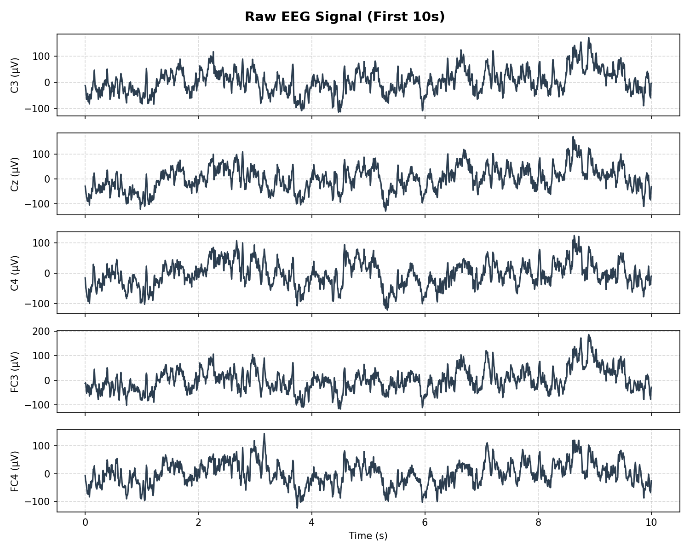
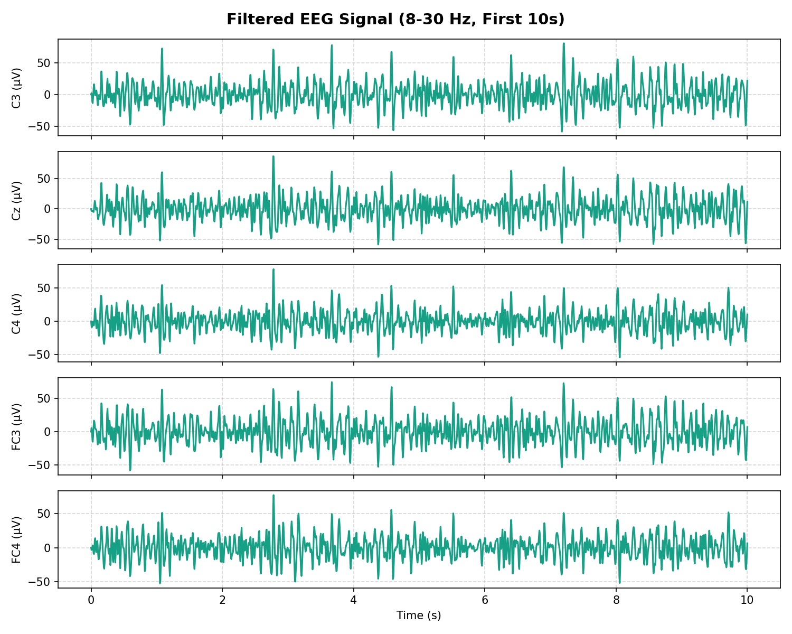
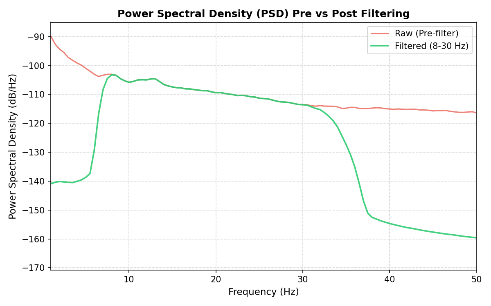
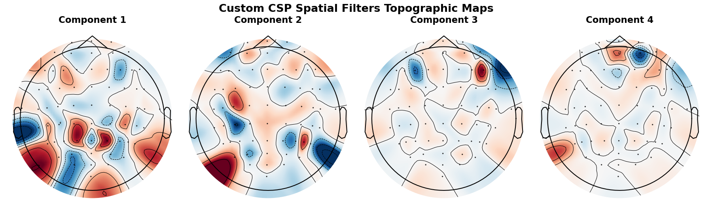
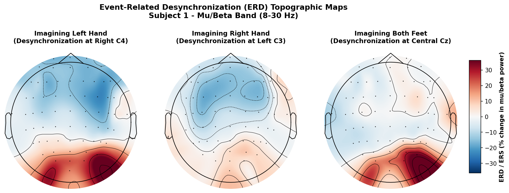
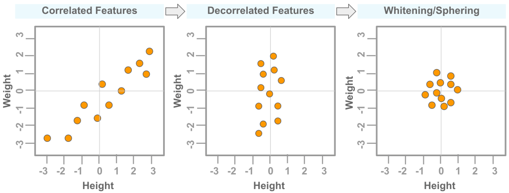
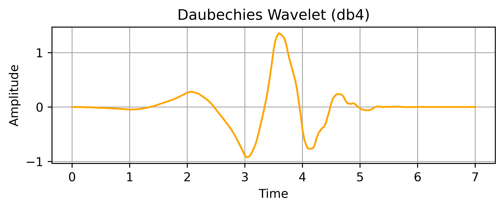

# Total Perspective Vortex — EEG Motor Imagery BCI

A production-ready Python Brain-Computer Interface (BCI) pipeline designed to classify EEG motor imagery signals (imagined hand vs. feet movement) from the PhysioNet dataset. The pipeline integrates a custom Common Spatial Patterns (CSP) dimensionality reduction algorithm with a classifier in a scikit-learn pipeline.

## Pipeline Architecture

The pipeline consists of the following processing steps:

1. **Preprocessing & Filtering (`preprocessing.py`)**:
   - Downloads EEG data (.edf files) using MNE's PhysioNet EEGBCI interface.
   - Cleans channel names and sets a standard 10-05 montage.
   - Bandpass filters signals to the mu and beta bands (8–30 Hz).
   - Epochs the data from $0.0\text{s}$ to $4.0\text{s}$ relative to event markers.
   - Applies peak-to-peak amplitude rejection (`reject=200μV`) with programmatic fallbacks (500μV, or no rejection) to handle high-noise/high-amplitude trials without crashing.
   - Maps event codes to binary labels (`T1` $\rightarrow 1$, `T2` $\rightarrow 2$).
   
   ##### Preprocessing Visual Examples (Subject 1, Run 3):
   * **Raw EEG Signal (first 10s, 5 channels)**:
     
   * **Filtered EEG Signal (8-30 Hz bandpass, same channels)**:
     
   * **Power Spectral Density (PSD) Pre vs. Post Filter Overlay**:
     

2. **Common Spatial Patterns (CSP) (`csp.py`)**:
   - Implements the CSP algorithm from scratch as a scikit-learn compatible transformer subclassing `BaseEstimator` and `TransformerMixin`.
   - Computes trace-normalized class covariances $\Sigma_1, \Sigma_2$ and composite covariance $\Sigma_c$.
   - Computes whitening transformation $P = \Lambda^{-1/2}V^T$.
   - Performs generalized eigendecomposition on whitened class covariances.
   - Project EEG epochs onto the selected $k$ components (first $k/2$ and last $k/2$ eigenvectors) to maximize class variance differences.
   - Returns the log-variance features of the spatially filtered signals.
   
   ##### Custom CSP Spatial Filters Topographic Maps:
   

3. **Classification & Validation (`pipeline.py` & `mybci.py`)**:
   - Integrates the custom CSP transformer with a scikit-learn Linear Discriminant Analysis (LDA) classifier.
   - Splits data into 80% train and 20% held-out test sets to prevent data leakage and overfitting.
   - Performs Stratified 10-Fold Cross-Validation on the training portion to validate stability.
   - Saves final models to the `models/` directory using pickle serialization.

4. **Streaming Simulator (`predict.py`)**:
   - Simulates real-time EEG streaming playback by predicting on held-out epochs one-by-one with a simulated $\leq 2\text{s}$ latency.

---

## Mathematical Foundations

### 1. Common Spatial Patterns (CSP)
The goal of CSP is to find a spatial filter projection matrix $W$ that maximizes the variance of one class while minimizing the variance of the other.

#### Usage of CSP in this Project
In EEG motor imagery BCI systems, imagined movement (e.g., left hand, right hand, or feet) triggers a physiological phenomenon known as **Event-Related Desynchronization (ERD)**. During ERD, the amplitude of the mu ($8-12\text{ Hz}$) and beta ($13-30\text{ Hz}$) bands decreases over the corresponding contralateral motor cortex. For example:
- Imagining **left hand** movement decreases mu/beta power over the **right** motor cortex (around electrode `C4`).
- Imagining **right hand** movement decreases mu/beta power over the **left** motor cortex (around electrode `C3`).
- Imagining **feet** movement decreases mu/beta power bilaterally near the longitudinal fissure (around electrode `Cz`).

##### Event-Related Desynchronization (ERD) Topographic Maps (Subject 1):


Because these power changes are spatially localized but mixed across the scalp electrodes due to volume conduction through the skull, raw EEG signals have a low signal-to-noise ratio. We use **CSP** as a supervised spatial filter to calculate scalp weightings that linearly combine the 64 electrodes. By finding the directions of maximum variance differences, CSP mathematically isolates these underlying motor cortex sources, focusing the classification model on the active regions of interest.

#### Spatial Covariance Estimation
For each class $c \in \{1, 2\}$, we calculate the normalized spatial covariance matrix from the epoched trial signal matrix $E \in \mathbb{R}^{C \times T}$ (where $C$ is the number of channels, and $T$ is the number of time samples):
$$\Sigma_c = \frac{1}{N_c} \sum_{i=1}^{N_c} \frac{E_i E_i^T}{\text{Tr}(E_i E_i^T)}$$
Normalizing by the trace ($\text{Tr}$) removes global power fluctuations and standardizes signal levels across trials.

#### Whitening and Decorrelation
EEG signals recorded from scalp electrodes exhibit strong spatial correlation. This is primarily caused by **volume conduction**, where electrical activity from a single cortical source propagates through the brain, meninges, skull, and scalp, and is picked up by multiple adjacent electrodes. This spatial correlation makes the channel covariance matrices highly redundant and ill-conditioned.

To address this, we apply a **whitening transformation** (also known as sphering). Whitening is a linear transformation that decorrelates the features (making the composite covariance diagonal) and scales their variance to 1 along all principal axes.

##### Mathematical Intuition
We compute the composite covariance matrix:
$$\Sigma_{\text{composite}} = \Sigma_1 + \Sigma_2$$
Using eigendecomposition, we write:
$$\Sigma_{\text{composite}} = V \Lambda V^T$$
where $V$ is the orthogonal matrix of eigenvectors, and $\Lambda$ is the diagonal matrix of eigenvalues. 
- The eigenvectors in $V$ represent the principal axes (spatial directions) of joint brain activity.
- The eigenvalues in $\Lambda$ represent the signal power (variance) along each of these principal directions.

The whitening transform matrix $P$ is computed as:
$$P = \Lambda^{-1/2} V^T$$
This transformation operates in two steps:
1. **Rotation ($V^T$)**: Rotates the electrode coordinate system to align with the principal axes of joint activity. This decorrelates the channels (the covariance matrix becomes diagonal).
2. **Scaling ($\Lambda^{-1/2}$)**: Scales the variance along each principal axis to exactly $1$. This compresses high-variance directions and stretches low-variance directions.

Applying $P$ to the composite covariance matrix transforms the total spatial variance into a sphere (represented by the identity matrix $I$):
$$P \Sigma_{\text{composite}} P^T = P \Sigma_1 P^T + P \Sigma_2 P^T = S_1 + S_2 = I$$
where $S_1 = P \Sigma_1 P^T$ and $S_2 = P \Sigma_2 P^T$ are the whitened class covariances.

##### Physical Importance in CSP
Because $S_1 + S_2 = I$, the eigenvalues of $S_1$ and $S_2$ are complementary:
- If a spatial direction has high variance in Class 1 ($S_1 b = d b$), it must have low variance in Class 2 ($S_2 b = (1-d)b$).
- This mathematical relationship ensures that the directions that best represent Class 1 (eigenvalues near $1$) are automatically the directions that worst represent Class 2 (eigenvalues near $0$).
- Without whitening, we would be searching for directions of maximum variance differences in a highly correlated, skewed space, which is numerically unstable and does not align cleanly with class boundaries. Whitening standardizes the space so that the subsequent generalized eigendecomposition can find the optimal discriminative angles.



#### Generalized Eigendecomposition
Since $S_1 + S_2 = I$, the eigenvectors that maximize the variance of $S_1$ must also minimize the variance of $S_2$, and vice-versa. We solve the generalized eigendecomposition of $S_1$:
$$S_1 B = B D$$
where $D$ is a diagonal matrix of eigenvalues sorted in ascending order ($0 \le d_i \le 1$), and $B$ contains the shared eigenvectors. Because $S_2 = I - S_1$, we have:
$$S_2 B = B (I - D)$$
- An eigenvalue $d_i \approx 1$ indicates that the corresponding eigenvector explains high variance in class 1 and low variance in class 2.
- An eigenvalue $d_i \approx 0$ (so $1 - d_i \approx 1$) indicates that the eigenvector explains low variance in class 1 and high variance in class 2.

#### Filter Projection Matrix
We select $k$ columns of $B$: the first $k/2$ columns (corresponding to the smallest eigenvalues of $S_1$) and the last $k/2$ columns (corresponding to the largest eigenvalues of $S_1$). This forms $B_{\text{selected}} \in \mathbb{R}^{C \times k}$.
The spatial projection matrix $W \in \mathbb{R}^{k \times C}$ is:
$$W = B_{\text{selected}}^T P$$
For any trial $E$, the spatially filtered signals are $Z = W E$. The feature vector $f \in \mathbb{R}^k$ represents the log-variance of each component:
$$f_j = \log(\text{Var}(Z_j))$$

---

### 2. Mathematical Flow of the Signal Processing Pipeline
The complete sequence of mathematical transformations applied to a single raw EEG recording session is described below:

#### Step 1: Spatial Standardization (Channel Selection)
Given a raw continuous EEG signal matrix $S_{\text{raw}}(t) \in \mathbb{R}^{C_{\text{raw}} \times T_{\text{session}}}$, we apply a linear channel mapping matrix $M_s \in \mathbb{R}^{C \times C_{\text{raw}}}$ (where $C = 64$ standard channels) to select and order the electrodes to standard 10-05 montage coordinates:
$$S(t) = M_s S_{\text{raw}}(t) \quad \in \mathbb{R}^{C \times T_{\text{session}}}$$

#### Step 2: Temporal Bandpass Filtering (Convolution)
For each channel $c \in \{1, \dots, C\}$, we apply a zero-phase finite impulse response (FIR) filter. The filtered signal $s_c^{\text{filt}}(t)$ is the convolution of the standardized channel signal $s_c(t)$ with the bandpass filter impulse response $h_{\text{BP}}(t)$ designed for $8 \le f \le 30\text{ Hz}$:
$$s_c^{\text{filt}}(t) = s_c(t) * h_{\text{BP}}(t)$$

#### Step 3: Epoching (Temporal Windowing)
For each trigger event $i$ occurring at session time $t_i$, we extract a temporal window of duration $4.0\text{ s}$, which at a sampling rate of $160\text{ Hz}$ yields $T = 640$ discrete time samples. This results in the trial epoch matrix $E_i$:
$$E_i(\tau) = S^{\text{filt}}(t_i + \tau), \quad \tau \in [0, 4\text{ s}]$$
where $E_i \in \mathbb{R}^{C \times T}$.

#### Step 4: Spatial Filtering (CSP Projection)
The high-dimensional channel space of the epoch $E_i$ is projected into the lower-dimensional source space $Z_i \in \mathbb{R}^{k \times T}$ ($k = 4$ components) using the learned CSP projection matrix $W \in \mathbb{R}^{k \times C}$:
$$Z_i = W E_i$$

#### Step 5: Feature Extraction (Log-Variance)
For each projected component $j \in \{1, \dots, k\}$ in $Z_i$, we calculate the log-transformed temporal variance:
$$f_{i, j} = \log \left( \frac{1}{T} \sum_{t=1}^T (z_{i, j}[t] - \mu_{i, j})^2 \right)$$
where $z_{i, j}[t]$ is the $t$-th time sample of component $j$, and $\mu_{i, j}$ is its mean over time. This yields the feature vector $f_i \in \mathbb{R}^k$.

#### Step 6: Classification (LDA Decision Boundary)
The feature vector $f_i$ is mapped to a class decision value using the Linear Discriminant Analysis (LDA) weight vector $w \in \mathbb{R}^k$ and bias term $b \in \mathbb{R}$:
$$y(f_i) = w^T f_i + b$$
The predicted class label is determined by the sign of the decision function:
$$\text{Class} = \begin{cases} 1 & \text{if } y(f_i) \ge 0 \\ 2 & \text{if } y(f_i) < 0 \end{cases}$$

---

### 2. Discrete Wavelet Transform (DWT)
The DWT decomposes a time-series signal into spatial-spectral-temporal components using localized waveforms (wavelets).

#### Continuous vs. Discrete Formulations
The Continuous Wavelet Transform (CWT) of a signal $x(t)$ is defined as:
$$W(a, b) = \frac{1}{\sqrt{a}} \int_{-\infty}^{\infty} x(t) \psi^*\left(\frac{t - b}{a}\right) dt$$
where $\psi(t)$ is the mother wavelet, $a$ is the scale parameter (frequency-related), and $b$ is the translation parameter (time-related).
For discrete analysis, we discretize $a$ and $b$ on a dyadic grid ($a = 2^j$ and $b = k 2^j$ for integers $j, k \in \mathbb{Z}$):
$$\psi_{j, k}(t) = 2^{-j/2} \psi(2^{-j} t - k)$$

#### Multi-Resolution Analysis (MRA)
Under Mallat's multiresolution framework, the signal is passed through a sequence of lowpass and highpass filters:
1. **Lowpass Filter $h$**: Derived from the scaling function $\phi(t)$, it yields the **Approximation coefficients ($A_j$)**, capturing low-frequency trends.
2. **Highpass Filter $g$**: Derived from the wavelet function $\psi(t)$, it yields the **Detail coefficients ($D_j$)**, capturing high-frequency fluctuations.

At each level $j$, the approximation from the previous level $a_{j-1}$ is filtered and downsampled by 2:
$$a_j[k] = \sum_{m} h[m - 2k] a_{j-1}[m]$$
$$d_j[k] = \sum_{m} g[m - 2k] a_{j-1}[m]$$

#### Energy Feature Extraction
For motor imagery, rather than using raw coefficients, we calculate the energy (power) contained in each decomposition level:
$$\text{Energy}_j = \sum_{k=1}^{M_j} |d_j[k]|^2$$
where $M_j$ is the number of coefficients at level $j$. We apply a logarithmic transform to stabilize variance:
$$f_{\text{dwt}, j} = \log(\text{Energy}_j)$$
These DWT energy features are calculated for each CSP-projected component, providing joint spatial and spectral motor imagery features.

#### Choice of the Daubechies 4 (db4) Wavelet



For this BCI pipeline, the Daubechies 4 (`db4`) wavelet is specifically selected based on the following mathematical and physical properties:

1. **Compact Support and Regularity**: The `db4` wavelet has $N = 4$ vanishing moments, corresponding to a scaling filter length of $2N = 8$ coefficients (support length of $2N - 1 = 7$). This provides an optimal balance between time localization (preventing temporal blur of short-duration event-related synchronization/desynchronization) and frequency localization (minimizing spectral leakage).
2. **Vanishing Moments**: A wavelet with $N$ vanishing moments satisfies:
   $$\int_{-\infty}^{\infty} t^p \psi(t) dt = 0 \quad \text{for } p = 0, 1, \dots, N-1$$
   This mathematical property allows the DWT to completely ignore polynomial trends of order up to 3 (such as low-frequency baseline drifts and slow physiological drifts) and focus entirely on high-frequency transient motor imagery details.
3. **Orthonormality**: As part of the Daubechies family, `db4` forms an orthonormal basis:
   $$\langle \psi_{j, k}, \psi_{l, m} \rangle = \delta_{j, l} \delta_{k, m}$$
   This ensures that the transform is energy-preserving (satisfying Parseval's theorem), meaning the sum of squared wavelet coefficients represents the exact physical signal power within that frequency band.
4. **Dyadic Sub-band Mapping**: Given the sampling frequency $f_s = 160\text{ Hz}$ (Nyquist limit $f_{\text{Nyq}} = 80\text{ Hz}$), a 4-level decomposition splits the spectrum into dyadic bands that isolate sensorimotor rhythms:
   - Level 2 detail ($D_2$): $20 - 40\text{ Hz} \rightarrow$ isolates the **Beta band**.
   - Level 3 detail ($D_3$): $10 - 20\text{ Hz} \rightarrow$ isolates the **Alpha / Mu band**.
   - Level 4 approximation ($A_4$): $0 - 5\text{ Hz} \rightarrow$ isolates slow physiological drifts.

---

## Installation & Setup

1. Create and activate the conda environment:
   ```bash
   conda create -n total-perspective-vortex python=3.10 -y
   conda activate total-perspective-vortex
   ```

2. Install dependencies:
   ```bash
   pip install -r requirements.txt
   ```

---

## CLI Usage

### 1. Model Training
Train a model on a specific subject and run. The model is saved to `models/subj{subject}_run{run}.pkl`.
```bash
python mybci.py <S> <R> train
```
*Example:*
```bash
python mybci.py 1 3 train
```

### 2. Streaming Prediction
Simulate real-time streaming classification using a pre-trained model.
```bash
python mybci.py <S> <R> predict
```
*Example:*
```bash
python mybci.py 1 3 predict
```

### 3. Batch Evaluation
Evaluate the pipeline across all 109 subjects and all 6 experiments.
```bash
# Standard batch evaluation
python mybci.py

# Batch evaluation with Wavelet bonus features
python mybci.py --wavelet
```

### 4. Visualization
Generate raw/filtered signal, PSD, and topographic CSP maps:
```bash
python visualize.py <subject> <run>
```
*Example:*
```bash
python visualize.py 1 3
```
*Output files generated:*
- `raw_signal_plot.png`
- `filtered_signal_plot.png`
- `psd_overlay_plot.png`
- `csp_filters_topomap.png`

---

## Optional Wavelet Preprocessing (Bonus)
Pass the `--wavelet` flag during training or batch evaluation to replace/augment standard log-variance features with discrete wavelet transform (DWT) energy features (db4 wavelet, level 4 decomposition).

---

## Interactive Jupyter Notebooks
Two focused Jupyter Notebooks are provided in the root directory for step-by-step analysis:

1. **[`eda.ipynb`](file:///Users/jikaewsi/Documents/code_and_scripts/Python/total-perspective-vortex/eda.ipynb)**: Exploratory Data Analysis including:
   - Loading raw EEG data and standardizing channels.
   - Inspecting recording metadata (sampling rate, channels list, duration).
   - Extracting event annotation codes and plotting trial distribution counts (bar chart).
   - Plotting the sequence and timing of events (event marks timeline).
   - Analyzing signal amplitude statistics, plotting regional boxplots, and central channel histograms.

2. **[`visualization.ipynb`](file:///Users/jikaewsi/Documents/code_and_scripts/Python/total-perspective-vortex/visualization.ipynb)**: EEG signal and pattern visualization including:
   - Plotting Raw vs. Bandpass-filtered signals side-by-side.
   - Frequency domain Power Spectral Density (PSD) analysis.
   - Scalp topographic mapping of Event-Related Desynchronization (ERD) for Left Hand, Right Hand, and Feet imagery.
   - Fitting and plotting the custom Common Spatial Patterns (CSP) spatial filters.

To launch either notebook, run:
```bash
jupyter notebook eda.ipynb
# or
jupyter notebook visualization.ipynb
```
